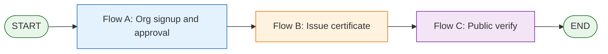
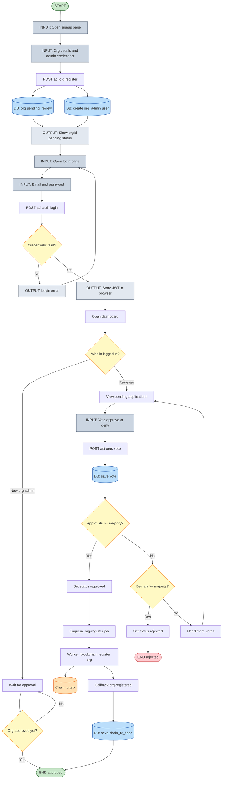
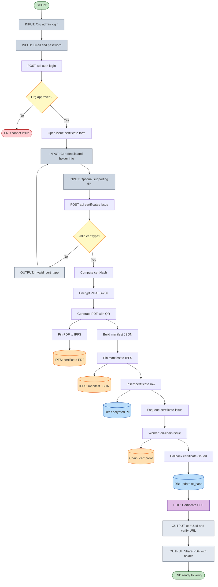
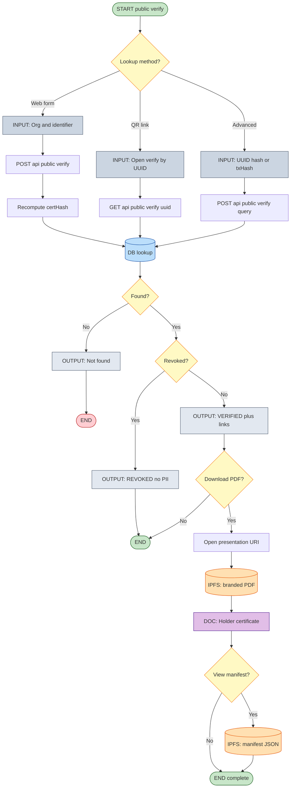

# DocVerifyBlock Complete System Guide

This document explains how the full system works end-to-end:
- **complete flowcharts** (signup, org approval, issuance, public verify) — see Section 2
- blockchain and smart contracts
- Hyperledger Fabric mode
- backend and workers flow
- certificate verification lifecycle
- organization registration/onboarding
- setup, run, and credentials configuration

---

## 1) What This Project Is

DocVerifyBlock is a decentralized certificate verification platform where:
- organizations issue certificates
- proof/state is written to blockchain (EVM or Fabric gateway mode)
- sensitive PII is kept off-chain and encrypted in the backend database
- public users can verify certificate validity without seeing raw personal data

Main services:
- `app` -> public/front app (`localhost:3000`)
- `admin-panel` -> admin UI (`localhost:3001`)
- `backend` -> API + business logic (`localhost:4000`)
- `workers` -> async chain-write jobs + callback updates
- `blockchain` -> Solidity contracts (`OrgRegistry`, `CertificateRegistry`)
- `infra` -> local Postgres + Redis via Docker Compose

---

## 2) Complete End-to-End Flowchart

Traditional flowchart notation (ISO-style shapes in Mermaid):

| Shape | Meaning | Mermaid syntax |
|-------|---------|----------------|
| **Oval** | Start / End (terminator) | `([text])` |
| **Rectangle** | Process / action | `[text]` |
| **Diamond** | Decision (yes/no branch) | `{text}` |
| **Gray rectangle** | Input or output (labels start with `INPUT:` or `OUTPUT:`) | `["INPUT: ..."]` |
| **Cylinder** | Data store (database, IPFS, blockchain) | `[("DB: ...")]` |
| **Purple rectangle** | Document / file produced | `["DOC: ..."]` |

> **Note:** Avoid Mermaid parallelogram syntax (`[/text/]`) when labels contain slashes (e.g. `/signup/`) — it breaks rendering. Use quoted rectangles instead.

View these in GitHub, VS Code (Mermaid preview), paste into [mermaid.live](https://mermaid.live), or open the **interactive GUI**:

**[PROJECT_WORKFLOW_FLOWCHART.html](./PROJECT_WORKFLOW_FLOWCHART.html)** — double-click to open in your browser (sidebar navigation, zoom, shape legend, all three flows).

### 2.1 System overview (how the three flows connect)

---

### 2.2 Flow A — Organization signup, login & network verification

**Voting rule:** Eligible voters = every **already approved** org (except the applicant) + **super_admin**. Majority = `floor(eligibleNodes / 2) + 1`.

---

### 2.3 Flow B — Login, upload data & issue certificate

**Upload note:** The optional file is hashed (SHA-256) into the manifest only; raw file bytes are not stored in Postgres.

---

### 2.4 Flow C — Public client verifies & retrieves document

**Privacy:** Public APIs always return `holderName: REDACTED`, `holderDob: REDACTED`, and a masked identifier only.

### 2.5 Role and URL quick reference

| Step | Who | UI | API |
|------|-----|-----|-----|
| Register org | Applicant | `/signup` | `POST /api/org/register` |
| Login | Org admin / super admin | `/login` | `POST /api/auth/login` |
| Vote on new org | Approved org admin, super admin | `/dashboard` | `POST /api/orgs/:orgId/vote` |
| Issue certificate | Approved org admin | `/dashboard` | `POST /api/certificates/issue` |
| Verify by UUID | Public | `/verify/[uuid]` | `GET /api/public/verify/:uuid` |
| Verify by identifier | Public | `/certificate-verification` | `POST /api/public/verify` |
| List issuers | Public | verification form dropdown | `GET /api/public/orgs` |

---

## 3) High-Level Architecture

1. Request hits backend API (org registration, certificate issue, verification, etc.).
2. Backend validates data, stores off-chain records in Postgres, and queues blockchain writes (`chain-write` queue in Redis).
3. Worker consumes queue job and submits transaction to:
   - EVM/Polygon via `ethers`, or
   - Hyperledger Fabric gateway via HTTP endpoints.
4. Worker calls backend internal callback endpoint with tx hash and metadata.
5. Backend updates DB record with blockchain transaction details.
6. Public verification APIs return status + redacted PII.

Why this split is used:
- API stays responsive (async transaction handling).
- Retry/failure handling is isolated in workers.
- Blockchain provider is swappable (EVM vs Fabric mode).

---

## 4) Smart Contracts (EVM Path)

Contracts live in `blockchain/contracts`.

### 4.1 `OrgRegistry.sol`
Purpose:
- register organizations
- mark active/inactive status
- authorize issuer addresses per organization

Core methods:
- `registerOrg(orgId, orgNameHash, sector, orgType, adminAddress)` (only owner)
- `deactivateOrg(orgId)` (only owner)
- `setOrgIssuer(orgId, issuer, isAuthorized)` (only owner)
- `isOrgActive(orgId)` view
- `isOrgIssuer(orgId, issuer)` view

### 4.2 `CertificateRegistry.sol`
Purpose:
- issue certificate state keyed by `certHash`
- revoke certificates
- verify existence/revocation/issue timestamp

Core methods:
- `issueCertificate(certHash, orgId, branchId, certType, metadataHash)`
- `revokeCertificate(certHash, reason)` (issuer or owner)
- `verifyCertificate(certHash)` view

Enforcement:
- issue requires active org in `OrgRegistry`
- issuer must be authorized in `OrgRegistry`

Important note:
- The backend worker currently calls contract methods for org registration and certificate issuance.
- Revocation in the current backend is off-chain status update in DB; no worker path currently writes revoke tx on-chain.

---

## 5) Hyperledger Fabric Mode (How It Works Here)

This project supports two blockchain provider modes:
- `BLOCKCHAIN_PROVIDER=evm` (default)
- `BLOCKCHAIN_PROVIDER=fabric`

In Fabric mode, worker does not use Solidity contracts directly. Instead it calls a Fabric gateway over HTTP:
- `POST {FABRIC_GATEWAY_URL}/transactions/register-org`
- `POST {FABRIC_GATEWAY_URL}/transactions/issue-certificate`

Request body sent by worker:
- `channel` -> `FABRIC_CHANNEL` (default `docverify`)
- `chaincode` -> `FABRIC_CHAINCODE` (default `certificates`)
- `payload` -> job payload (`org-register` or `certificate-issue`)

Expected response:
- JSON with `txHash` or `transactionId`

If gateway does not return a tx identifier, worker treats it as failure.

What this means practically:
- Fabric support in this repo is gateway-driven integration mode.
- You must run/provide a compatible Fabric gateway service that exposes the required endpoints.

---

## 6) Backend Internals

Backend entry point behavior:
- validates env
- creates store (`PostgresStore` when `DATABASE_URL` exists, else memory store)
- initializes schema tables if missing
- seeds super admin
- seeds bootstrap org accounts in non-production (unless overridden)

### 6.1 Security and privacy
- PII (`holderName`, `holderDob`) is encrypted using AES-256-GCM (`AES_256_KEY` required).
- Public verify endpoints never return raw PII (only masked identifier + redacted fields).
- Certificate lookup uses deterministic `stableCertHash(orgId|certType|identifierValue)` in lowercase trimmed form.
- JWT role auth controls admin actions.

### 6.2 Storage model (Postgres)
Main tables:
- `users`
- `organizations`
- `certificates`
- `certificate_votes`
- `org_registration_votes`

Key persisted chain references:
- organization chain tx hash -> `organizations.chain_tx_hash`
- certificate chain tx hash -> `certificates.tx_hash`
- manifest hash + CID -> `certificates.manifest_digest`, `certificates.ipfs_cid`

---

## 7) Worker Internals

Worker queue names:
- `bulk-certificate-import` (currently intentionally unsupported)
- `chain-write` (active blockchain write path)

Chain-write jobs:
- `org-register`
- `certificate-issue`

Execution path:
1. Read job payload from Redis queue.
2. Submit tx via provider mode:
   - EVM: `submitEvmTx()`
   - Fabric: `submitFabricTx()`
3. Callback to backend internal endpoint with `x-chain-worker-token`.
4. Backend verifies token and updates DB record.

Dev-only behavior:
- If live EVM config is missing and `ALLOW_SYNTHETIC_CHAIN_TX=true`, worker generates synthetic tx hash for local simulation.
- In production, synthetic tx path is blocked.

---

## 8) Full Lifecycle Flows

### 8.1 New organization registration and approval
1. Organization submits `POST /api/org/register`.
2. Backend stores org as `pending_review` and creates org admin account.
3. Eligible reviewers (`approved org admins` + `super_admin`) vote via `POST /api/orgs/:orgId/vote`.
4. Once majority reached:
   - approve -> org marked `approved`, `org-register` chain job enqueued.
   - deny -> org marked `rejected`.
5. Worker writes org registration to blockchain provider.
6. Worker calls `/internal/chain/org-registered` with tx hash.
7. Backend stores `chain_tx_hash` for org.

### 8.2 Certificate issuance
1. Org admin calls `POST /api/certificates/issue`.
2. Backend verifies role/org status and computes `certHash`.
3. Backend builds manifest, computes canonical SHA-256 digest, optionally pins JSON to IPFS.
4. Backend stores certificate row with encrypted PII.
5. Backend enqueues `certificate-issue` chain job.
6. Worker submits chain tx and callbacks `/internal/chain/certificate-issued`.
7. Backend updates `tx_hash` in certificate record.

### 8.3 Public verification
Verification endpoints:
- `GET /api/public/verify/:uuid`
- `POST /api/public/verify` (orgId + certType + identifierValue)
- `POST /api/public/verify/query` (uuid/hash/tx search)

What verifier gets:
- certificate status (`verified`/`revoked` etc.)
- orgId, certType, issueDate
- txHash
- certHash, manifestDigest, ipfsCid/manifestUri
- redacted PII fields (never raw encrypted payload)

---

## 9) Credentials and Environment Variables

Create `.env` from `.env.example` at repo root.

Important: do not commit real secrets. Values below are categories and examples only.

### 9.1 Required core backend/worker values
- `DATABASE_URL` (Postgres connection)
- `REDIS_URL` (Redis connection)
- `JWT_ACCESS_SECRET`
- `JWT_REFRESH_SECRET`
- `CHAIN_WORKER_TOKEN` (must match backend and workers)
- `AES_256_KEY` (minimum 32 chars)

### 9.2 Admin/bootstrap values
- `SUPER_ADMIN_EMAIL`
- `SUPER_ADMIN_PASSWORD`
- `ORG_ADMIN_EMAIL_DOMAIN`
- Optional `BOOTSTRAP_ORG_ACCOUNTS` JSON array (dev pre-approved org users)

### 9.3 EVM provider values
- `BLOCKCHAIN_PROVIDER=evm`
- `RPC_URL`
- `CHAIN_ID`
- `ORG_REGISTRY_ADDRESS`
- `CERT_REGISTRY_ADDRESS`
- `ISSUER_PRIVATE_KEY`

### 9.4 Fabric provider values
- `BLOCKCHAIN_PROVIDER=fabric`
- `FABRIC_GATEWAY_URL`
- `FABRIC_CHANNEL`
- `FABRIC_CHAINCODE`

### 9.5 IPFS values

Certificate issuance **requires** a successful manifest pin unless `IPFS_OPTIONAL_IN_DEV=true` in non-production (never in production). Set one of:

- `IPFS_KUBO_API_URL` — local Kubo (e.g. `http://127.0.0.1:5001` after `npm run infra:up`, which includes the `ipfs` service).
- `IPFS_PINATA_JWT` — Pinata `pinJSONToIPFS`.

Vitest uses a deterministic synthetic CID when no provider is configured.

- `IPFS_GATEWAY_PREFIX`

### 9.6 Frontend value
- `NEXT_PUBLIC_API_URL=http://localhost:4000`

### 9.7 Local infra defaults (from Docker compose)
- Postgres:
  - user: `postgres`
  - password: `postgres`
  - db: `docverify`
  - port: `5432`
- Redis:
  - port: `6379`

### 9.8 Existing sample/default credentials in codebase
For development only, backend seeds sample org accounts in non-production if not overridden. These are examples and should be changed in real deployments:
- `registrar@northbridgeacademy.edu` / `Northbridge#2026`
- `cert-office@crestviewit.edu` / `Crestview#2026`
- `controller@riverdalecollege.edu` / `Riverdale#2026`

Super admin defaults fall back if env not set:
- email: `admin@example.com`
- password: `change-me-in-env`

Use explicit secrets in `.env` for anything beyond local testing.

---

## 10) Setup and Run (Local)

From repository root:

1) Install dependencies
- `npm install`

2) Start local infra (Postgres + Redis)
- `npm run infra:up`

3) Create `.env` from `.env.example` and fill secrets

4) Run backend + public app + admin panel
- `AES_256_KEY=12345678901234567890123456789012 npm run dev:all`

5) Run full stack including workers
- `AES_256_KEY=12345678901234567890123456789012 npm run run:beast`

Service URLs:
- Public app: `http://localhost:3000`
- Admin panel: `http://localhost:3001`
- Backend API: `http://localhost:4000`

Health check:
- `GET http://localhost:4000/health`

---

## 11) EVM Contract Deployment Notes

The `blockchain` workspace includes contracts and Hardhat config, but no deploy script in this repository by default.

Typical path:
1. Add/develop deployment scripts under `blockchain/scripts`.
2. Compile/test:
   - `npm run build -w blockchain`
   - `npm run test -w blockchain`
3. Deploy and capture addresses.
4. Set `ORG_REGISTRY_ADDRESS` and `CERT_REGISTRY_ADDRESS` in `.env`.
5. Ensure issuer wallet is authorized in `OrgRegistry` for intended orgs (`setOrgIssuer`).

Without valid deployed addresses/authorization, EVM chain writes will fail (unless synthetic tx is enabled in dev).

---

## 12) How Verification Is Stored and Proven

Off-chain (Postgres):
- full operational record
- encrypted PII
- status/revocation metadata
- tx hash and manifest digest/CID references

On-chain / Fabric ledger:
- immutable registration/issuance proof data
- transaction traceability via tx hash

Public verification is the combined outcome of:
- backend certificate status
- deterministic certificate hash matching
- blockchain transaction references
- optional IPFS manifest digest/CID linkage

---

## 13) Common Troubleshooting

- `Missing AES_256_KEY` or short key:
  - set `AES_256_KEY` to at least 32 characters.
- Chain callbacks unauthorized:
  - ensure backend + worker use same `CHAIN_WORKER_TOKEN`.
- Queue enqueue failures:
  - confirm Redis is up and `REDIS_URL` is correct.
- No chain tx hash updates:
  - verify worker process is running and callback URL/token are correct.
- EVM errors `evm_chain_config_missing`:
  - set RPC/private key/contract addresses or enable synthetic tx for dev only.
- Fabric errors:
  - ensure gateway URL is reachable and endpoints return `txHash`/`transactionId`.

---

## 14) Production Security Checklist

- rotate all secrets from `.env.example`
- never use default/sample passwords
- disable synthetic tx mode (`ALLOW_SYNTHETIC_CHAIN_TX=false`)
- use strong JWT and worker tokens
- restrict CORS origins
- secure Postgres/Redis/network boundaries
- enforce HTTPS and key management for env secrets

